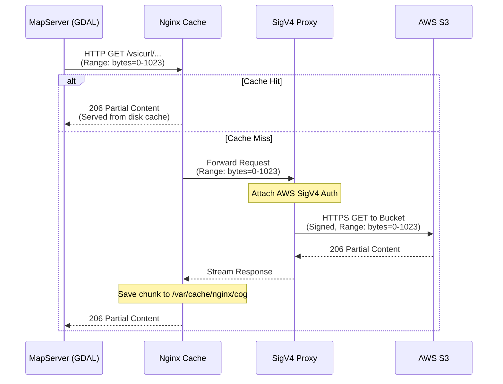

# MapServer COG Caching Architecture

This document explains how this project optimizes MapServer and GDAL's performance when reading Cloud Optimized GeoTIFFs (COGs) from AWS S3. Instead of relying on GDAL's native `/vsis3/` driver, it uses a shared Nginx caching layer combined with a local AWS SigV4 signing proxy.

## The Problem: Cache Fragmentation in FastCGI

In a traditional setup, MapServer uses GDAL's `/vsis3/` virtual file system to read COGs from S3. GDAL optimizes these reads using the `VSI_CACHE` mechanism, which caches byte ranges in memory. 

However, MapServer typically runs under FastCGI with multiple worker processes (e.g., `MAPSERVER_NUMPROCS=6`). Because `VSI_CACHE` is an **in-memory, per-process cache**, each worker process maintains its own independent cache. This leads to several issues:
1. **Memory Bloat**: Identical byte ranges (such as COG headers and overviews) are cached redundantly in memory across multiple processes.
2. **Redundant Network Requests**: If Worker A fetches a byte range, and later Worker B needs the same range, Worker B will make a duplicate request to S3 because it cannot access Worker A's cache.
3. **S3 Cost and Latency**: More cache misses mean more S3 `GET` requests and higher latency for the end user.

## The Solution: Nginx as a Shared Range Cache

To solve this, the architecture shifts the caching responsibility out of the individual GDAL processes and into a single, shared Nginx reverse proxy. 

### Architecture Flow

1. **GDAL Request**: Instead of `/vsis3/`, the MapServer configuration instructs GDAL to fetch files using `/vsicurl/http://127.0.0.1:8001/<object-key>`.
2. **Nginx Cache Layer**: Nginx listens on `127.0.0.1:8001` and acts as a caching proxy. It intercepts the HTTP requests (which include `Range: bytes=N-M` headers).
3. **Cache Hit**: If the requested byte range is already in Nginx's on-disk cache (`/var/cache/nginx/cog`), it is served immediately to GDAL.
4. **Cache Miss**: If the range is not cached, Nginx forwards the request to a local Python proxy running on `127.0.0.1:9000`.
5. **AWS SigV4 Proxy**: The Python proxy (`etc/s3_sigv4_proxy.py`) receives the unsigned request, attaches an AWS Signature Version 4 (SigV4) authorization header using the container's IAM role credentials, and sends the request to the private S3 bucket.
6. **Response**: The signed S3 response streams back through Nginx, which writes the byte range to disk and serves it back to GDAL.



---

## Key Configurations

### Nginx Cache Key Design
GDAL makes partial reads using HTTP `Range` requests. To cache these effectively, Nginx must treat each byte range as a separate cache entry. This is achieved by including `$http_range` in the cache key:

```nginx
proxy_cache_key "$request_method:$request_uri:$http_range";
```

### Handling GDAL HEAD Probes
Before fetching data, GDAL typically issues a `HEAD` request to determine the file size and verify its existence. By default, Nginx converts `HEAD` cache misses into `GET` requests to populate the cache for future reads. 

For gigabyte-sized COGs, converting a `HEAD` request into a `GET` without a `Range` header would trigger a full-file download from S3. To prevent this, the configuration explicitly disables this behavior:

```nginx
proxy_cache_convert_head off;
```
This ensures `HEAD` requests remain `HEAD` requests when sent upstream, safely caching the metadata response without downloading the entire raster.

### The SigV4 Signing Proxy
AWS S3 requires all API requests to be signed unless the bucket is entirely public. Because Nginx open-source does not natively support AWS SigV4 signing, the architecture delegates this to a lightweight Python HTTP server (`etc/s3_sigv4_proxy.py`).

By placing the signer *behind* the Nginx cache:
- **CPU Overhead is Minimized**: Only cache misses require the cryptographic overhead of calculating a SigV4 signature.
- **Cache Hits are Instant**: Nginx can serve cache hits directly from disk without needing any AWS credentials or signatures.

---

## Summary of Benefits

1. **Eliminates Fragmentation**: All MapServer worker processes read from the same Nginx disk cache.
2. **Reduces Memory Footprint**: Instead of allocating large `VSI_CACHE` blocks in RAM for every process, the system relies on the OS page cache to manage the on-disk Nginx cache efficiently.
3. **Lowers S3 Costs**: Deduplicating range requests across workers drastically reduces the volume of `GET` requests sent to S3.
4. **Improved Performance**: Cache hits are served locally at disk speed without SigV4 signing overhead or network latency.
